# Breadly Architecture Document

> Last updated: April 2026

## Table of Contents

1. [Overview](#1-overview)
2. [System Architecture](#2-system-architecture)
3. [Infrastructure Architecture](#3-infrastructure-architecture)
4. [Monorepo Structure](#4-monorepo-structure)
5. [API Layer](#5-api-layer)
6. [Backend Architecture](#6-backend-architecture)
7. [Frontend Architecture](#7-frontend-architecture)
8. [Authentication Architecture](#8-authentication-architecture)
9. [Testing Architecture](#9-testing-architecture)
10. [CI/CD Pipeline](#10-cicd-pipeline)
11. [Error Handling Architecture](#11-error-handling-architecture)
12. [E2E Testing & data-testid Conventions](#12-e2e-testing--data-testid-conventions)
13. [Developer Workflow: Type Generation](#13-developer-workflow-type-generation)
14. [Component Architecture](#14-component-architecture)
15. [Key Architectural Decisions](#15-key-architectural-decisions)
16. [Glossary](#16-glossary)

---

## 1. Overview

Breadly is a recipe management application built as an API-first monorepo. A single OpenAPI specification serves as the contract between an Angular 21 frontend and an Express 5 backend, both generating types from that shared source of truth.

### Tech Stack

| Layer | Technology |
|-------|-----------|
| **API Contract** | OpenAPI 3.1, Redocly |
| **Frontend** | Angular 21, TypeScript 5.9, Tailwind CSS v4, Vitest, Angular Testing Library |
| **Backend** | Express 5, TypeScript, MongoDB, Vitest, supertest |
| **E2E** | Playwright, Vitest |
| **Infrastructure** | Terraform (AWS), Docker Compose (local) |
| **Auth** | AWS Cognito (OIDC code flow), JWT |

---

## 2. System Architecture

```mermaid
graph TB
    subgraph Client["Browser"]
        SPA[Angular SPA<br/>Recipes | Profile | Health]
    end

    subgraph AWS["AWS Infrastructure"]
        CF[CloudFront CDN]
        subgraph FrontendDeploy["Static Hosting"]
            S1[S3 Bucket<br/>Angular build]
        end
        subgraph BackendDeploy["Backend"]
            API_GW[API Gateway<br/>HTTP API]
            LAMBDA[Lambda<br/>Express Server]
            MONGO[(MongoDB)]
        end
        COG[Cognito<br/>User Pool]
    end

    subgraph Preview["Preview Environments"]
        PE1[Preview A<br/>/feature/a/]
        PE2[Preview B<br/>/feature/b/]
        PE3[Preview N<br/>/feature/n/]
    end

    SPA -->|HTTPS| CF
    CF -->|/*| S1
    CF -->|/api/*| API_GW
    CF -->|/preview/<slug>/| API_GW

    API_GW --> LAMBDA
    LAMBDA --> MONGO
    LAMBDA -->|JWT decode| COG
    SPA -->|Login| COG

    API_GW --> PE1
    API_GW --> PE2
    API_GW --> PE3
```

### Request Flow

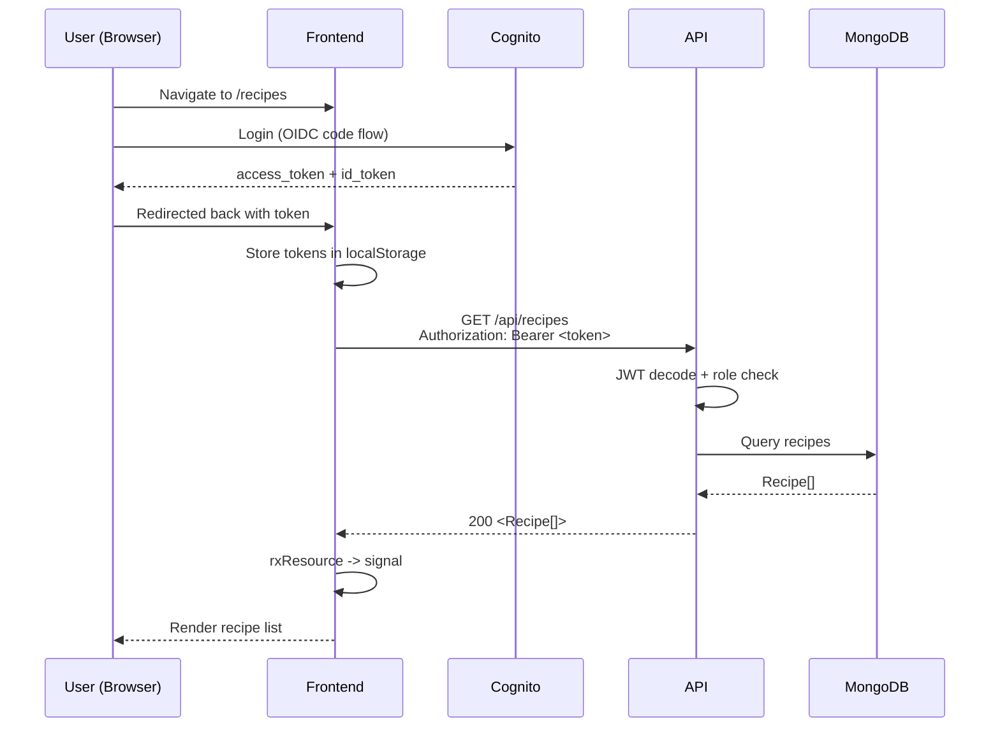

---

## 3. Infrastructure Architecture

### Production Deployment

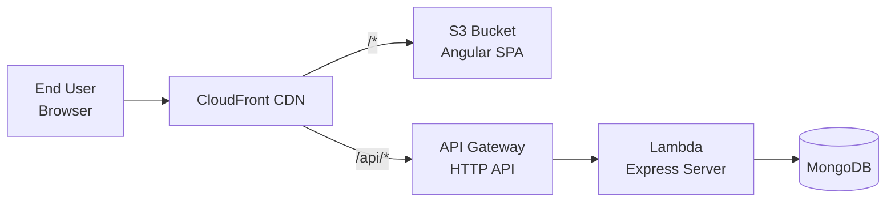

### Preview Environment Per Branch

Each feature branch gets a full-stack deployment at `/preview/<branch-slug>/`:

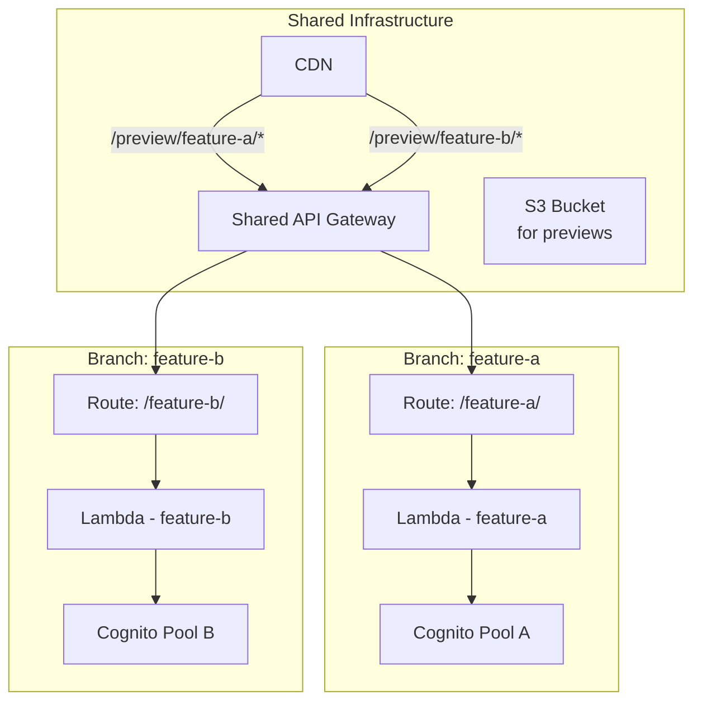

### Local Development

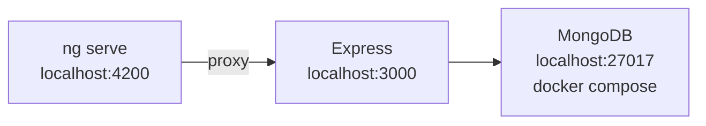

### Environments

| Environment | Terraform Workspace | Trigger |
|------|-----------|-------|
| **Local** | N/A (Docker Compose) | `docker compose up` |
| **Dev** | `dev` | Push to `main` |
| **Prod** | `prod` | Manual dispatch |
| **Preview** | `preview-<branch-slug>` | Branch push / cleanup on deletion |

---

## 4. Monorepo Structure

```
breadly/
├── breadly-api/                         # OpenAPI spec -- single source of truth
│   ├── openapi.yaml                     # All endpoints, schemas, contracts
│   ├── .redocly.yaml                    # Redocly configuration
│   └── package.json                     # Redocly lint
│
├── breadly-backend/                     # Express 5 REST API
│   ├── src/
│   │   ├── app.ts                       # Express app setup, route registration
│   │   ├── server.ts                    # Entry point (DB init + listen)
│   │   ├── auth/                        # Role definitions
│   │   │   └── roles.config.ts          # ADMIN, USER, PREMIUM_USER
│   │   ├── common/                      # Shared utilities
│   │   │   ├── validation.middleware.ts # Zod-based validation
│   │   │   ├── validation-schemas.ts    # Zod schema definitions
│   │   │   ├── logger.ts                # Pino logger instance
│   │   │   ├── branch-slug.ts           # Git branch → URL slug
│   │   │   └── config/env.ts            # Centralized env config
│   │   ├── config/                      # Environment config (planned)
│   │   ├── database/                    # MongoDB connection
│   │   │   ├── application-database.ts  # MongoClient singleton
│   │   │   └── mongodb.config.ts        # Collection names + connection
│   │   ├── domain/                      # Shared domain types
│   │   │   └── error.types.ts           # ApplicationError class
│   │   ├── features/                    # Feature modules
│   │   │   ├── recipe/                  # Full CRUD
│   │   │   │   ├── recipe.controller.ts # Express Router
│   │   │   │   ├── recipe.service.ts    # Business logic + data access
│   │   │   │   ├── recipe.model.ts      # Stored document shape
│   │   │   │   ├── recipe.controller.http
│   │   │   │   └── * .controller.spec.ts
│   │   │   │   └── recipe.service.spec.ts
│   │   │   ├── profile/                 # JWT claims → Profile DTO
│   │   │   ├── public/                  # Runtime config endpoint
│   │   │   └── operation/               # Health, version
│   │   │       ├── version.reader.ts
│   │   ├── middleware/                  # Cross-cutting middleware
│   │   │   ├── auth.middleware.ts       # JWT decode + role check
│   │   │   ├── error.middleware.ts      # Global error handler
│   │   │   └── preview-path.middleware.ts
│   │   └── app/generated/               # Auto-generated API types (gitignored)
│   └── package.json
│
├── breadly-frontend/                    # Angular 21 SPA
│   ├── src/
│   │   ├── app/
│   │   │   ├── app.ts                   # Root component
│   │   │   ├── app.config.ts            # App providers + config
│   │   │   ├── app.routes.ts            # Top-level routing
│   │   │   ├── app.spec.ts
│   │   │   ├── auth/                    # OIDC auth
│   │   │   │   ├── auth.service.ts      # OAuthService wrapper
│   │   │   │   ├── auth.guard.ts        # withAuth() CanActivateFn
│   │   │   │   ├── auth.config.ts       # buildAuthConfig()
│   │   │   │   ├── auth-error.interceptor.ts
│   │   │   │   ├── login.component.ts
│   │   │   │   ├── callback.component.ts
│   │   │   │   └── logout.component.ts
│   │   │   ├── config/                  # Runtime config
│   │   │   │   ├── config.service.ts
│   │   │   │   └── config-error.component.ts
│   │   │   ├── features/                # Feature modules
│   │   │   │   ├── recipes/
│   │   │   │   │   ├── recipes.service.ts
│   │   │   │   │   ├── recipes.routes.ts
│   │   │   │   │   ├── recipes.router.component.ts
│   │   │   │   │   ├── containers/
│   │   │   │   │   │   └── recipes-list.container.ts
│   │   │   │   │   └── components/
│   │   │   │   │       ├── recipe-form.component.ts
│   │   │   │   │       └── recipe-list.component.ts
│   │   │   │   ├── profile/
│   │   │   │   │   ├── profile.container.ts
│   │   │   │   │   └── profile.component.ts
│   │   │   │   ├── health/
│   │   │   │   │   ├── health.service.ts
│   │   │   │   │   ├── health.routes.ts
│   │   │   │   │   ├── health.router.component.ts
│   │   │   │   │   ├── containers/
│   │   │   │   │   └── components/
│   │   │   ├── shared/                  # Cross-cutting shared code
│   │   │   │   ├── helpers/
│   │   │   │   │   ├── to-signal-fn.ts  # Observable → signal helper
│   │   │   │   │   └── profile-display-name.ts
│   │   │   │   ├── components/
│   │   │   │   │   ├── spinner.component.ts
│   │   │   │   │   ├── skeleton.component.ts
│   │   │   │   │   ├── error-banner.component.ts
│   │   │   │   │   └── form-field.component.ts
│   │   │   │   ├── layout/
│   │   │   │   │   ├── layout.component.ts
│   │   │   │   │   └── navbar/
│   │   │   │   │       ├── nav.config.ts
│   │   │   │   │       ├── navbar.container.ts
│   │   │   │   │       ├── navbar.component.ts
│   │   │   │   │       └── profile-menu.component.ts
│   │   │   │   ├── services/
│   │   │   │   │   └── profile.service.ts
│   │   │   ├── generated/               # Auto-generated API client (gitignored)
│   │   │   │   ├── api/
│   │   │   │   ├── model/
│   │   │   │   ├── provide-api.ts
│   │   │   │   └── configuration.ts
│   │   │   └── testing/                 # Test infrastructure
│   │   │       └── render-with-providers.ts
│   │   └── assets/
│   │       └── i18n/de.json             # German translations
│   └── angular.json
│
├── e2e/                                 # Playwright E2E tests
│   ├── fixtures/
│   │   └── auth.fixture.ts
│   ├── pages/
│   │   ├── auth/login.page.ts
│   │   ├── recipes/
│   │   │   ├── recipe-list.page.ts
│   │   │   ├── recipe-form.page.ts
│   │   │   └── recipe-detail.page.ts
│   │   ├── profile/profile.page.ts
│   │   ├── health/health.page.ts
│   │   └── shared/navbar.page.ts
│   ├── tests/
│   │   ├── recipes/manage-recipe.spec.ts
│   │   ├── auth/sign-in-out.spec.ts
│   │   ├── profile/view-profile.spec.ts
│   │   ├── health/view-health.spec.ts
│   │   └── navigation/browse-pages.spec.ts
│   ├── helpers/
│   │   ├── cognito.helper.ts
│   │   └── test-data.helper.ts
│   ├── global-setup.ts
│   └── playwright.*.config.ts
│
├── infrastructure/
│   ├── aws/
│   │   ├── deploy/                      # Dev/prod (Terraform workspaces)
│   │   ├── frontend/
│   │   │   └── setup/                   # One-time S3 + DynamoDB bootstrap
│   │   ├── backend/
│   │   │   └── modules/                 # API Gateway module
│   │   ├── preview/
│   │   │   ├── gateway/                 # Shared preview infra
│   │   │   └── deploy/                  # Per-branch preview
│   │   ├── cdn/
│   │   │   ├── deploy/
│   │   │   └── modules/cloudfront/      # CloudFront + OAC + bucket policy
│   │   └── modules/                     # Reusable Terraform modules
│   │       ├── cognito/
│   │       ├── lambda_express/
│   │       ├── api_gateway/
│   │       ├── api_gateway_routes/
│   │       ├── cloudfront/
│   │       └── s3_static_site/
│   └── local/
│       └── docker-compose.yml           # MongoDB container
│
└── docs/
    ├── architecture/
    │   └── architecture.md              # This document
    ├── prd/
    │   ├── scheduler-and-reminders.md
    │   └── custom-auth-ui.md
    └── Notes.md
```

---

## 5. API Layer

The OpenAPI specification is the single source of truth for all API contracts.

### Endpoints

| Method | Path | Auth | Description |
|--------|------|------|-------------|
| `GET` | `/public/config` | No | Runtime environment config (OIDC issuer, client ID) |
| `GET` | `/recipes` | Yes | List all recipes |
| `POST` | `/recipes` | Yes | Create a recipe |
| `GET` | `/recipes/{id}` | Yes | Get a recipe by ID |
| `PUT` | `/recipes/{id}` | Yes | Fully replace a recipe |
| `PATCH` | `/recipes/{id}` | Yes | Partially update a recipe |
| `DELETE` | `/recipes/{id}` | Yes | Delete a recipe |
| `GET` | `/profile` | Yes | Get authenticated user profile from JWT claims |
| `GET` | `/health` | No | System health (API + database) |
| `GET` | `/version` | No | Build version info (git SHA) |

### API Schema Model

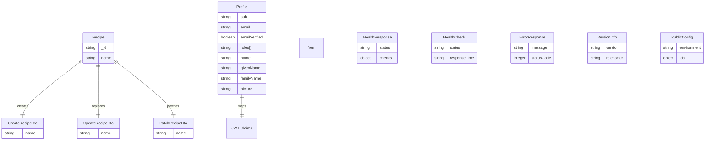

### Code Generation

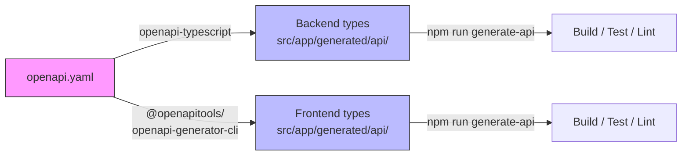

**Generation Difference:**

| Project | Generator | Output |
|---------|-----------|--------|
| **Backend** | `openapi-typescript` | Plain TypeScript types |
| **Frontend** | `@openapitools/openapi-generator-cli` | Angular API client service + models |

**Rules:**

- Generated code is gitignored -- never manually edited
- Changes to API types always start in `openapi.yaml`
- Both projects regenerate types after pulling spec changes
- Validation: `npm run lint` in `breadly-api/`

---

## 6. Backend Architecture

### Layering Model

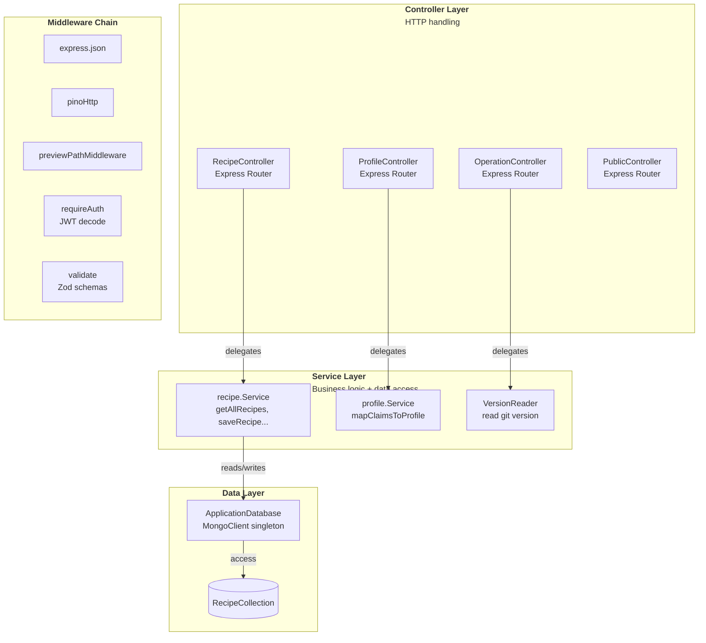

### Middleware Chain

```
Request → express.json() → pinoHttp() → previewPathMiddleware()
                                    → /api         → OperationController
                                    → /api/public  → PublicController
                                    → /api/recipes → requireAuth() → RecipeController
                                    → /api/profile → requireAuth() → ProfileController
                                    → globalErrorHandler() (last)
```

### Express App Setup (`app.ts` -- 27 lines)

```
1. express.json()                  -- body parser
2. pinoHttp()                      -- structured HTTP request logging
3. previewPathMiddleware()         -- strips preview path prefix (Lambda)
4. Routes (in order: public first, then authenticated):
   /api                          → operationController
   /api/public                   → publicController
   /api/recipes                  → requireAuth() + recipeController
   /api/profile                  → requireAuth() + profileController
5. globalErrorHandler()           -- catches all ApplicationError and generic errors
```

### Feature File Structure

Data-backed features:

```
features/<name>/
├── <name>.controller.ts          # Express Router -- HTTP only
├── <name>.service.ts             # Business logic + data access (plain async functions)
├── <name>.model.ts               # Stored document shape (interface)
├── <name>.controller.http        # Manual REST test requests
├── <name>.controller.spec.ts     # Integration tests (supertest)
└── <name>.service.spec.ts        # Unit tests (mocked dependencies)
```

Non-data features (pure controller):

```
features/<name>/
├── <name>.controller.ts
├── <name>.controller.http
└── <name>.controller.spec.ts
```

### Recipe Feature Detail

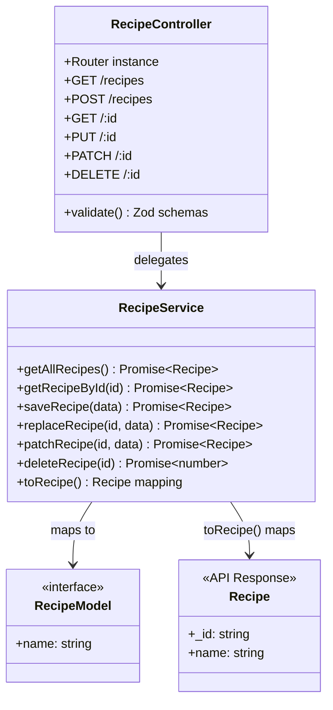

### Auth Middleware -- JWT Decoding

Backend decodes JWT **base64url** encoded payloads directly -- no external JWT library:

```
Request Header: Authorization: Bearer <token>
                        |
                        v
              +---------------------------+
              |  Split JWT at '.'         |
              |  Parts: header.payload.sig|
              +---------------------------+
                        |
                        v
              +---------------------------+
              |  base64urlDecode(payload) |
              +---------------------------+
                        |
                        v
              +---------------------------+
              |  CognitoClaims {           |
              |    sub                 # string    |
              |    email               # string    |
              |    email_verified      # boolean   |
              |    name                # string    |
              |    given_name          # string    |
              |    family_name         # string    |
              |    picture             # string    |
              |    'cognito:Groups'    # string[]  |
              |   }                          |
              +----------------------------+
                        |
                        v
              +----------------------------+
              |  req.user = claims          |
              |  requireAuth() checks       |
              |   roles vs Groups           |
              +----------------------------+
```

### Database Layer

```typescript
// ApplicationDatabase -- Singleton class wrapping MongoClient and Db
// Methods: init() | getCollections() | ping() | close()

interface DbCollections {
  RecipeCollection: Collection<RecipeModel>;
}

// Compile-time assertion ensures every collection has a corresponding entry
```

### Error Handling

```typescript
class ApplicationError extends Error {
  statusCode: number;

  constructor(message: string, statusCode: number) {
    super(message);
    this.statusCode = statusCode;
  }
}
```

Business errors are thrown as `ApplicationError` and caught by `globalErrorHandler`. Standard `Error` objects default to HTTP 500.

---

## 7. Frontend Architecture

### App Bootstrap

```
index.html → main.ts → platformBrowser()
                                  |
                                  v
                              App Component
                                  |
              +---------------------+---------------------+
              |                                           |
      configLoaded (true)                        configLoaded (false)
              |                                           |
              v                                           v
         LayoutComponent                        ConfigErrorComponent
              |
        NavbarContainer
              |
          RouterOutlet
              |
      +-------+--------+--------+
      |            |             |
  Home    Recipes     Health   Profile
```

### Component Hierarchy

```
App
├── LayoutComponent (structural shell)
│   ├── NavbarContainerComponent (smart)
│   │   ├── NavbarComponent (dumb)
│   │   └── ProfileMenuComponent (dumb)
│   └── ContentArea (max-w-screen-2xl, mx-auto)
│       └── RouterOutlet
│           ├── HomeContainerComponent (smart)
│           │   └── HomeComponent (dumb)
│           ├── RecipesRouterComponent
│           │   └── RecipesListContainerComponent (smart)
│           │       ├── RecipeFormComponent (dumb)
│           │       └── RecipeListComponent (dumb)
│           ├── ProfileContainerComponent (smart)
│           │   └── ProfileComponent (dumb, external template)
│           └── HealthContainerComponent (smart)
│               ├── HealthDashboardComponent (dumb)
│               └── VersionInfoComponent (dumb)
```

### Routing

```mermaid
graph LR
    R1[/<br/>HomeContainer]
    R2[/recipes<br/>loadChildren]
    R3[/health<br/>loadChildren]
    R4[/profile]
    R5[/login]
    R6[/oidc-callback]
    R7[/logout]
    R8[** → /]
    R9[recipe → /recipes]

    R1 --> Home
    R2 --> REC_SUB
    R3 --> HLT_SUB
    R4 --> PROF
    R5 --> LOGIN
    R6 --> CB
    R7 --> LOGOUT

    REC_SUB --> REC_LIST
    HLT_SUB --> HEALTH_LIST

    classDef authed fill:#f9f
    class R2,R4 authed
```

### Smart/Dumb Component Split

```mermaid
graph LR
    Smart["Smart Component<br/>(Container/Page)"]
    Dumb["Dumb Component<br/>(.component.ts)"]

    Smart -->|data via input()| Dumb
    Dumb -->|events via output()| Smart

    style Smart fill:#bfb
    style Dumb fill:#bbf
```

| Type | Suffix | Location | Responsibility |
|------|--------|----------|----------------|
| **Container** | `.container.ts` | `containers/` | Smart: injects services, fetches data, manages state |
| **Page** | `.page.ts` | `pages/` | Smart: same as container + reads URL state |
| **Component** | `.component.ts` | `components/` | Dumb: `input()` / `output()` only, no injected services |

### Signals-Only State Management

```mermaid
graph TB
    Generated["Generated API Service<br/>Observable-returning methods"]
    FeatureSvc["Feature Service<br/>rxResource / resource"]
    Container["Smart Component<br/>consumes signals"]
    DumbComponent["Dumb Component<br/>receives signals as input"]

    Generated -->|stream: () => api.getRecipes()| FeatureSvc
    FeatureSvc -->|recipes.value(): Recipe[]| Container
    Container -->|recipes: signal&lt;Recipe[]&gt;| DumbComponent
```

### Key Shared Components

| Component | Purpose |
|-----------|---------|
| `SpinnerComponent` | Loading spinner (Tailwind `animate-spin`) |
| `SkeletonComponent` | Ghost placeholders (configurable shapes + sizes) |
| `ErrorBannerComponent` | Inline error display |
| `FormFieldComponent` | Label + input + validation errors |
| `LayoutComponent` | Navbar + constrained content area (`max-w-screen-2xl`) |
| `ProfileService` | Cross-cutting user profile (root singleton) |

### Testing Utilities

| Utility | Purpose |
|---------|---------|
| `renderWithProviders()` | Pre-configured ATL renderer with translation passthrough |
| `to-signal-fn.ts` | Helper to wrap Observables into signals |
| `profile-display-name.ts` | Helper for display name computation |

---

## 8. Authentication Architecture

### OIDC Login Flow

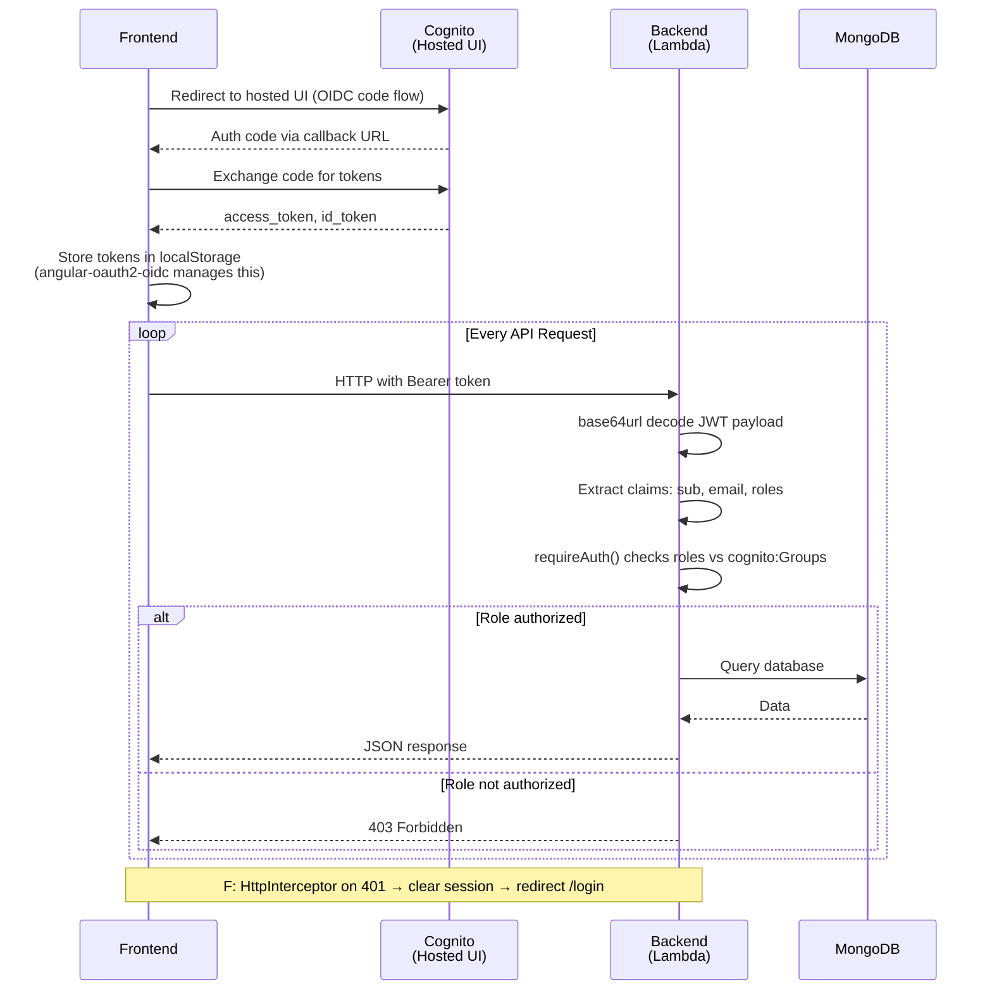

### Frontend Auth Components

```mermaid
graph LR
    AS[AuthService<br/>OAuthService wrapper]
    AG[AuthGuard<br/>withAuth() CanActivateFn]
    AE[AuthErrorInterceptor<br/>HttpInterceptorFn]
    AC[AuthConfig<br/>buildAuthConfig()]
    LC[LoginComponent]
    CC[CallbackComponent]
    LO[LogoutComponent]

    AS --> AG
    AS --> AE
    AS --> AC
    AS --> LC
    AS --> CC
    AS --> LO
```

### Frontend Auth Configuration

```typescript
// app.config.ts -- Application providers
providers: [
  provideApi('api'),                          // Generated API services
  provideRouter(routes, withPreloading(<PreloadAllModules)),
  provideHttpClient(
    withInterceptorsFromDi(),
    withInterceptors([authErrorInterceptor])  // 401 → clear session → /login
  ),
  provideOAuthClient({                        // OIDC configuration
    resourceServer: {
      sendAccessToken: true,
      allowedUrls: ['api'],
    },
  }),
  importProvidersFrom(
    TranslateModule.forRoot({ fallbackLang: 'de' })
  ),
  provideTranslateHttpLoader({ prefix: './assets/i18n/', suffix: '.json' })
]
```

### Roles

```typescript
// roles.config.ts
Roles = {
  ADMIN: 'ADMIN',
  USER: 'USER',
  PREMIUM_USER: 'PREMIUM_USER'
} as const;
```

Used by both frontend (`withAuth({ roles: ['ADMIN'] })`) and backend (`requireAuth([Role.ADMIN])`).

---

## 9. Testing Architecture

### Test Pyramid

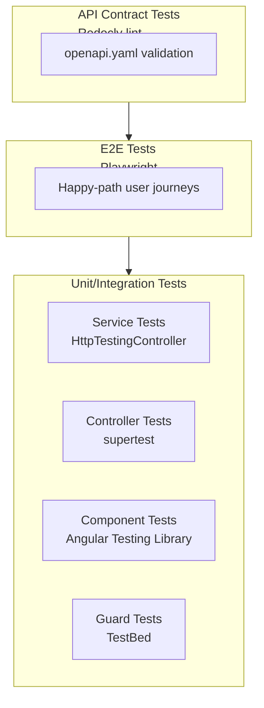

### Testing Boundary Matrix

| Artifact | Testing Tool | Mock Boundary |
|----------|-------------|---------------|
| **Dumb components** | ATL (`renderWithProviders`) | None -- isolated with `componentInputs` + `on` |
| **Containers/Pages** | ATL (`renderWithProviders`) | Feature service (controllable signals) |
| **Root component** | ATL (`renderWithProviders`) | `ConfigService` (controllable signals) |
| **Feature services** | TestBed + `HttpTestingController` | HTTP layer |
| **Auth/shared services** | TestBed + `HttpTestingController` | HTTP layer |
| **Pure functions** | Plain Vitest | None |
| **Guards** | TestBed | Injected services |
| **Interceptors** | TestBed + `HttpTestingController` | HTTP layer |

### Translation Passthrough Mode

In tests, `TranslateModule` has no loader -- `DefaultMissingTranslationHandler` returns the key as-is. So `{{ 'RECIPES.EMPTY' \| translate }}` renders literally as `RECIPES.EMPTY` in the DOM.

Tests assert against stable translation keys, not German translations. This eliminates all `FakeLoader` classes.

### Query Priority

Follow Testing Library query priority -- highest confidence first:

1. `getByRole` -- buttons, headings, lists, links, alerts (primary)
2. `getByLabelText` -- form fields
3. `getByText` -- static text content (translation keys in passthrough mode)
4. `getByTestId` -- escape hatch for elements without semantic roles (e.g., status indicators)

### Forbidden Patterns (Component Tests)

- `fixture.componentInstance` access
- `querySelector` / `querySelectorAll`
- `spyOn(component.output, 'emit')`
- `TestHostComponent` wrappers
- `beforeEach` for component rendering
- `expect(component).toBeTruthy()` smoke tests
- `FakeLoader` classes for `ngx-translate`
- `HttpTestingController` in container/page tests

---

## 10. CI/CD Pipeline

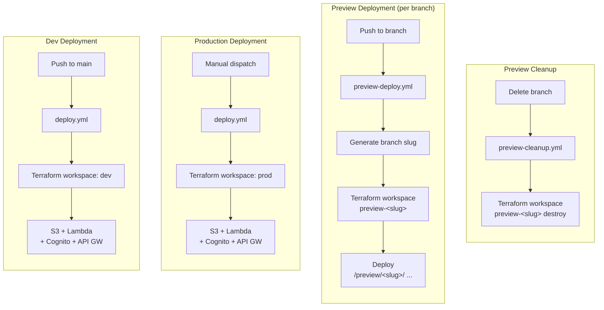

---

## 11. Error Handling Architecture

### Frontend Error Handling

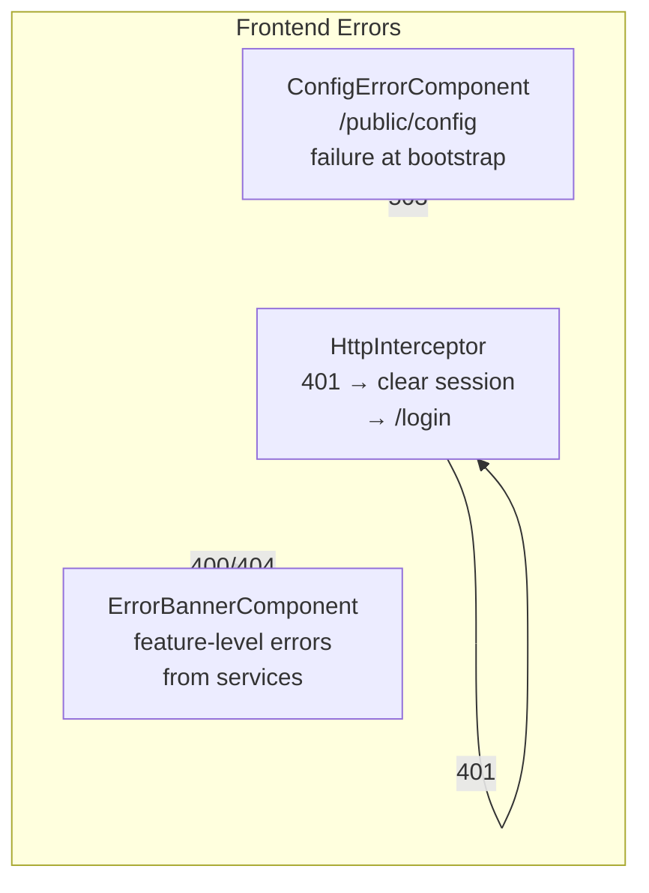

### Backend Error Handling

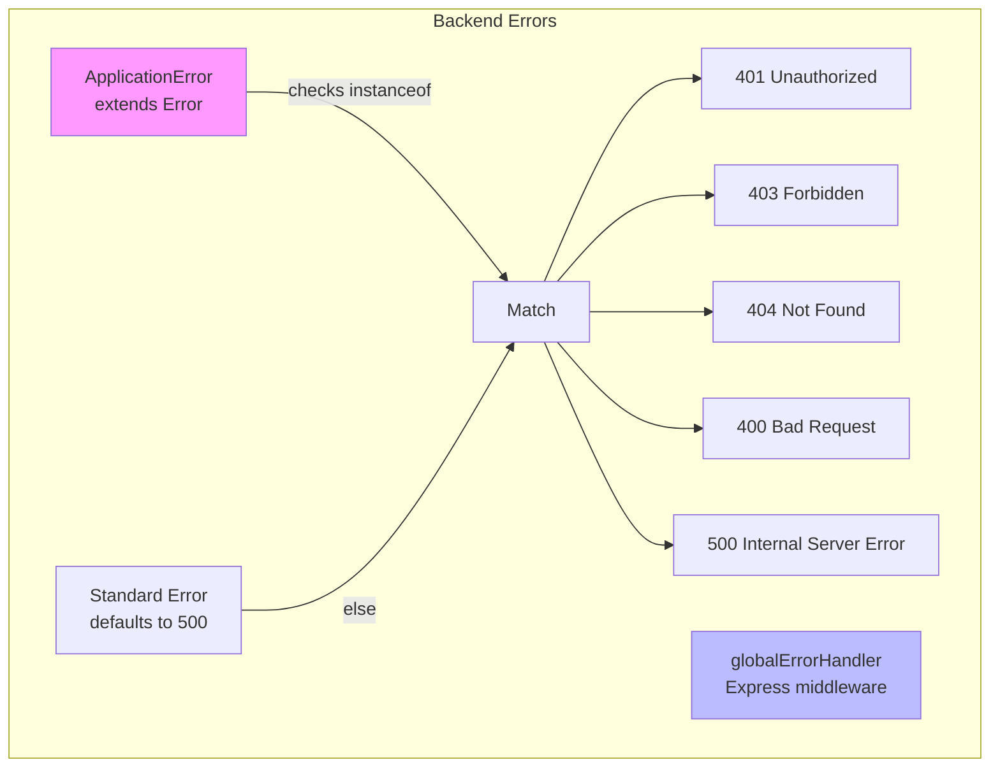

---

## 12. E2E Testing & data-testid Conventions

### Page Object Pattern

```
Frontend Template                          E2E Page Object
────────────────                       ─────────────────
recipe-[data-testid="recipe-            RecipeListPage
list-item"                           ├── .recipeList                = getByTestId('recipe-list')]
                                    ├── .recipeNameInput         = getByTestId('recipe-name-input')]
                                     ├── .addRecipeButton       = getByTestId('recipe-add-btn')]
                                     └── .deleteRecipeButtons  = getByTestId(/^recipe-delete-btn-/)]
```

### data-testid Conventions

| Prefix | Feature | Example |
|--------|---------|---------|
| `recipe-` | Recipes | `recipe-list`, `recipe-name-input`, `recipe-add-btn` |
| `nav-` | Navigation | `nav-recipes-link`, `nav-profile-trigger`, `nav-login-btn` |
| `profile-` | Profile | `profile-email`, `profile-title` |
| `health-` | Health | `health-title`, `health-reload-btn` |
| `home-` | Home | `home-title`, `home-login-btn` |

### Naming Format

`<feature>-<element>` using kebab-case. Only on interactive and key structural elements.

### Test Data Convention

Test data uses `[E2E-<test-name>]` prefix + `Date.now()` for uniqueness:

```typescript
uniqueName('manage-recipe', 'Banana Bread')
→ '[E2E-manage-recipe] Banana Bread-1234567890123-1'
```

---

## 13. Developer Workflow: Type Generation

When implementing features with API changes, follow this pipeline in order:

### Full Feature Implementation

```mermaid
flowchart LR
    A1["1. Update openapi.yaml<br/>breadly-api/"] --> A2["2. Validate<br/>npm run lint (breadly-api/)"]
    A2 -->|pass| B1["3. Generate backend types<br/>npm run generate-api (breadly-backend/)"]
    A2 -->|fail| A1
    B1 --> B2["4. Implement backend<br/>controller + service + model"]
    B2 --> B3["5. Generate frontend types<br/>npm run generate-api (breadly-frontend/)"]
    B3 --> B4["6. Implement frontend<br/>container + components + service"]
    B4 --> B5["7. Lint + Build + Test<br/>per-project"]
    B5 --> B6["8. Write E2E tests"]
    B6 --> B7["9. Run E2E tests"]
    B7 --> B8["10. Code review"]
```

### Pure Frontend Changes

```
6. Implement frontend features
7. Lint + Build + Test (frontend only)
8. Write E2E test
9. Code review
```

### Pure Backend Changes

```
1. Update openapi.yaml
2. Validate spec
3. Generate backend types
4. Implement backend features
5. Lint + Build + Test (backend only)
6. Code review
```

### Key Rules

1. **API-First:** Changes to API types always start in `openapi.yaml`
2. **Validate before implementing:** `npm run lint` in `breadly-api/` must pass
3. **Regenerate types:** Both projects run `npm run generate-api` before building
4. **Never edit generated code:** Generated `src/app/generated/` is gitignored
5. **Per-project verification:** lint → build → test in each affected project
6. **E2E mandatory for user-facing features:** At least one happy-path spec required
7. **Smart skipping:** Skip phases that are not relevant to the current task

---

## 14. Component Architecture

### Component Naming Conventions

| Type | Suffix | Location | Example |
|------|--------|----------|---------|
| **Router Component** | `.router.component.ts` | Feature root | `recipes.router.component.ts` |
| **Container** | `.container.ts` | `containers/` | `recipes-list.container.ts` |
| **Page** | `.page.ts` | `pages/` | `recipe-detail.page.ts` |
| **Component** | `.component.ts` | `components/` | `recipe-card.component.ts` |
| **Service** | `.service.ts` | Feature root | `recipes.service.ts` |
| **Routes** | `.routes.ts` | Feature root | `recipes.routes.ts` |

### Selector Prefixes

| Feature | Prefix |
|---------|--------|
| Recipes | `recipe-` |
| Profile | `profile-` |
| Health | `health-` |
| Shared | `app-` |
| Auth | `auth-` |
| Home | `home-` |

### State Management Scoping

| State Type | Location | Example |
|------------|----------|---------|
| **Feature-scoped** | Feature service (`<feature>.service.ts`) | Recipe list, recipe form state |
| **Cross-cutting** | `providedIn: 'root'` shared service | Auth state, user profile |
| **Component-local** | Component-level `signal()` | UI toggles, form dirty state |

---

## 15. Key Architectural Decisions

### ADR 1: API-First Contract

**Decision:** OpenAPI 3.1 spec is the single source of truth for all API types and contracts.

**Why:** Ensures frontend and backend stay aligned. Eliminate type drift and manual DTO maintenance.

**Consequences:**
- Both frontend and backend generate types from the same `openapi.yaml`
- No hand-written DTOs permitted
- Changes must start in the OpenAPI spec
- Generated code is gitignored and must never be manually edited
- **Trade-off:** Adding endpoints or changing types requires regenerating types for both projects (but this is automated via CI `npm run generate-api`)

### ADR 2: Signals-Only State Management

**Decision:** Use Angular signals exclusively -- no NgRx or external state libraries.

**Why:** Simpler than NgRx, built into Angular 21, less boilerplate, better performance.

**Consequences:**
- Feature services wrap generated API services using `rxResource()` / `resource()`
- Observables are converted to signals at the boundary
- No `async` pipe except in containers when conversion is not feasible
- No orphan subscriptions -- managed via `takeUntilDestroyed()` or auto-complete
- **Trade-off:** Potential complexity with deeply nested components in large apps (mitigated by strict smart/dumb component split and feature-scoped state)

### ADR 3: Smart/Dumb Component Split

**Decision:** Strict separation between smart (containers/pages) and dumb (components) components.

**Why:** Enforces testability (dumb components test with mocked inputs, smart components with controllable service signals), reusability (dumb components are pure rendering logic), and clear boundaries.

**Consequences:**
- Dumb components receive data via `input()` and emit events via `output()` -- never inject services
- Smart components inject services, manage state, and delegate rendering
- **Risks:** May feel verbose for simple features, but eliminates the most common source of coupling in Angular apps

### ADR 4: JWT Decoding Without External Libraries

**Decision:** Backend decodes JWT base64url encoded payloads directly -- no `jsonwebtoken` dependency.

**Why:** Reduces dependency surface, no need for `jsonwebtoken` or `jose` -- Cognito claims are predictable.

**Consequences:**
- Simpler dependency tree
- Cognito-specific claims mapped directly
- Works reliably for the specific Cognito deployment
- **Risks/Limitations:** Less flexible with different JWT providers; if backend ever needs to support non-Cognito auth, this approach would need re-evaluation

### ADR 5: Preview Per Branch

**Decision:** Each feature branch gets a full-stack deployment accessible at `/preview/<branch-slug>/`.

**Why:** Enables integration testing and code review on every branch.

**Consequences:**
- Full integration testing on every branch
- Separate Cognito user pool per preview (isolated auth)
- Shared S3 bucket + API Gateway with path-based routing
- Automated cleanup on branch deletion
- **Risks:** Higher infra costs (each preview is a full deployment); mitigated by automated cleanup on branch deletion

### ADR 6: No Comments Policy

**Decision:** Code must be self-explanatory through clear naming and small, focused functions.

**Why:** Comments decay faster than code. Well-named code is the best documentation.

**Consequences:**
- Explicitly documented in AGENTS.md for both frontend and backend
- Architecture docs (like this one) serve as the living documentation layer

### ADR 7: Tailwind CSS v4 with Utility-First Styling

**Decision:** Tailwind CSS v4 with utility classes only -- no component library.

**Why:** No component library dependency (faster build, smaller bundle), faster customization, simpler mental model.

**Consequences:**
- All styling via Tailwind utility classes
- Extract repeated patterns with `@apply` only when used 3+ times
- No dark mode (not in scope)
- **Risks/Limitations:** Less consistent spacing/sizing decisions across developers; mitigated by Tailwind default design tokens and `@apply` for shared patterns

---

## 16. Glossary

| Term | Definition |
|------|------------|
| **OpenAPI spec** | The single source of truth API contract (`openapi.yaml`) used to generate types for both frontend and backend |
| **rxResource()** | Angular reactive data fetching utility that returns signal-based resources (`isLoading()`, `value()`, `error()`) -- wraps Observables |
| **smart component** | Container or page that injects services, fetches data, and manages state |
| **dumb component** | Pure rendering component that receives data via `input()` and emits events via `output()` -- never injects services |
| **Cognito claims** | User profile data derived from JWT (e.g. `sub`, `email`, `roles`, `cognito:Groups`) |
| **Preview environment** | Full-stack deployment for each feature branch, accessible at `/preview/<branch-slug>/` |
| **data-testid** | HTML attribute used by E2E Page Objects to locate DOM elements (format: `<feature>-<element>`) |
| **base64url** | Base64 encoding variant used in JWTs (uses `-` and `_` instead of `+` and `/`) |
| **ApplicationError** | Custom error class with `statusCode` property -- caught by `globalErrorHandler` middleware |
| **renderWithProviders** | Shared Angular Testing Library utility that pre-configures `TranslateModule` with passthrough mode for tests |
| **translation passthrough** | Test behavior where `{{ 'KEY' \| translate }}` renders literally as `KEY` (not German text), enabling stable test assertions |
| **Terraform workspace** | Terraform mechanism for environment isolation (`dev`, `prod`, `preview-&lt;slug&gt;`) |
| **Smart skipping** | Rule that omits irrelevant phases in the development pipeline (e.g., skip backend verification for pure frontend changes) |
| **`providedIn: 'root'`** | Angular DI option that registers a singleton service |
| **`inject()`** | Angular function for dependency injection (replaces constructor injection) |
